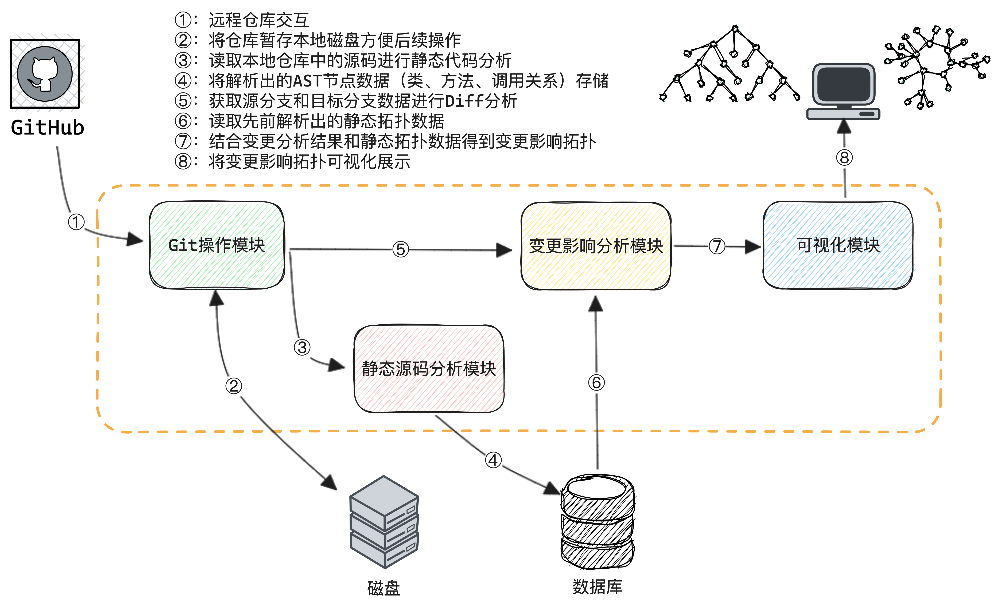
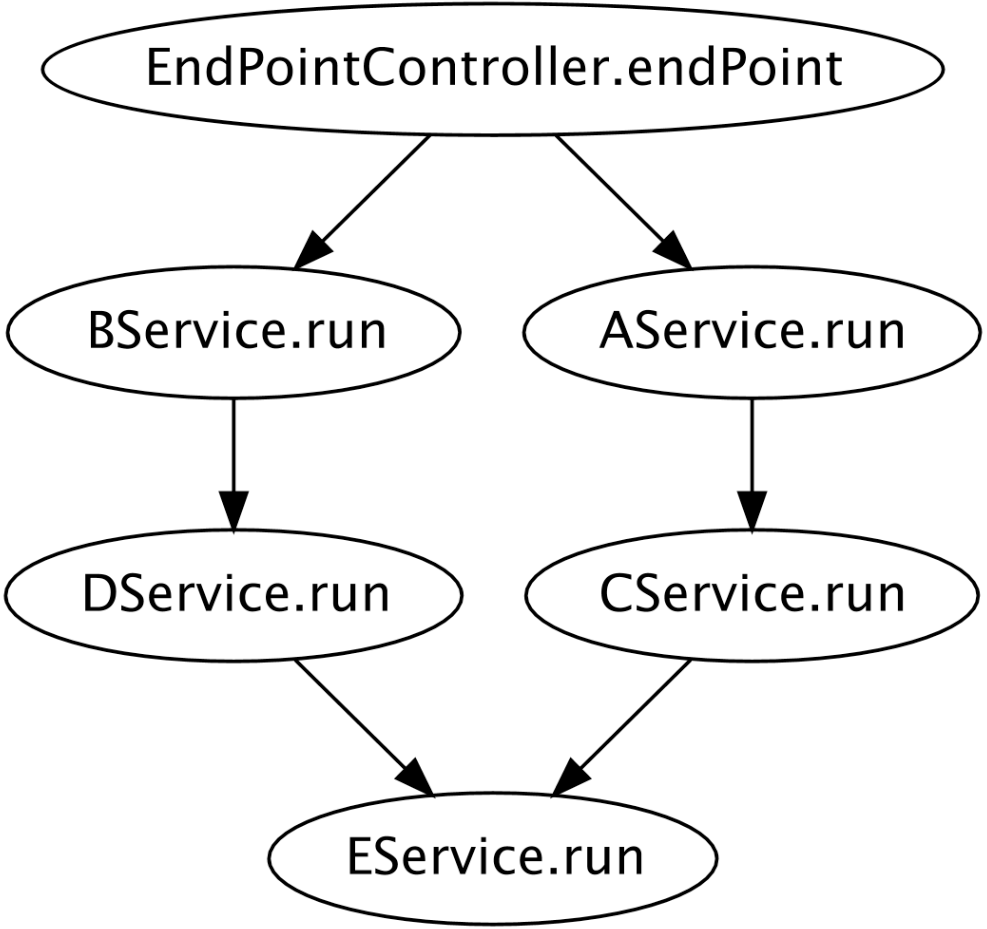

# java-call-graph-diff

本项目为GitBook: 《 [Code-Visualization](https://xiexiao064.gitbook.io/code-visualization) 》的实践案例，想了解更多代码可视化的相关知识推荐阅读此书籍。

## 项目概述
> Java implementation of CallGraph.

CG的Java实现方式。采用源码静态分析方式，提供静态调用关系图生产和代码变更影响面分析能力。

## 实现思路

## 测试方式
测试入口：com.analysis.cg.core.StaticAnalysisServiceTest
- 生成静态CG  
**核心方法**：com.analysis.cg.core.source.StaticAnalysisService.methodCallGraph

- 变更影响CG(依赖静态CG)    
**核心方法**：com.analysis.cg.core.source.StaticAnalysisService.codeChangeMethods

## Connect with Me
- Email: [xiexiao064@gmail.com](mailto:xiexiao064@gmail.com)
- WeChat: ShawnLFF
- 公众号: 肖恩杂谈

License
---

This code is distributed under the MIT license. See `LICENSE` in this directory.

